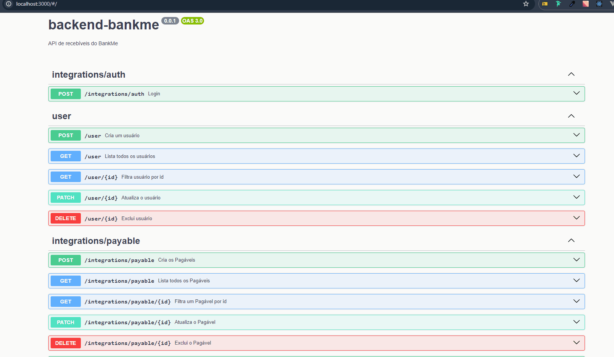

<p align="center">
<a href="https://bankme.tech/" target="blank"></a>

</p>


## Descrição

API construida utilizando Nestjs e SQlite com authenticação JWT. O projeto visa permitir ao usuário realizar as operações de CRUD para o Cedente e os Pagáveis de uma instituição financeira baseados nas permissões que o usuário tem no sistema.

Sobre a segurança do aplicativo, adicionei o `@nestjs/throttler` para impedir ataques de força bruta na API. E também a senha de login usuário deve conter no mínimo 8 characteres, incluindo um símbolo, uma letra maíscula e um número pelo menos.

Eu adicionei um Guard para a possibilidade de diferenciação de autorização dos usuários entre `admin` e `user` permitindo que os usuários tenham acesso limitado a determinandas funções dentro do app. 

Também tentei implementar lotes usando o `@nestjs/bull`, creio que ainda seja necessário algum aprimoramento.

O banco de dados utilizado foi o SQLite com o PrismaORM permitindo assim mais fácil acesso ao banco. Adicionei também alguns campos extras no banco de dados para verificar quando um registro é criado ou atualizado.

Além disso, adicionei um Dockerfile para facilitar o uso do projeto. As instruções de como usar estão na Secção sobre o Instalação abaixo.


## Stack

[](https://skillicons.dev)


## Instalação

```bash
$ npm install
```

## Rodando o app

```bash
# development
$ npm run start

# watch mode
$ npm run dev

# production mode
$ npm run start:prod
```

## Rodando o app com Docker

```bash
# Use the command on git bash 
$ docker run -p 3000:3000 -it backend-bankme:bankme
```
<!-- ## Test

```bash
# unit tests
$ npm run test

# e2e tests
$ npm run test:e2e

# test coverage
$ npm run test:cov
``` -->
## Deploy
O deploy da api foi realizado na DigitalOcean e pode ser verificado aqui: 
`https://bankme-api-5n7gl.ondigitalocean.app/`.
Esta página já direciona para o Swagger da applicação.

## Documentação

Também é possível verificar as rotas do projeto, rodando a api localmente e acessando  `http://localhost:3000`, em que a página inicial do projeto já mostrará o Swagger da API.
Também é possível verificar o Swagger no servidor `https://bankme-api-5n7gl.ondigitalocean.app/`.




## Melhorias

1) Adicionar o Mail service para complementar a rota de batch `integrations/payable/batch`.

2) Eu criei um Guard para administrar as autorizações da api de forma que `admin` e `users` podem ter acesso ou não a determinadas funcionalidades mas é necessário um refinamento técnico para decidir quais funcionalidades devem ou não estar disponíveis para cada tipo de usuário.
Atualmente, qualquer pessoa com o login pode acessar todas as funcionalidades da aplicação, mas creio que seria interessante, por exemplo, permitir que somente admins pudessem excluir registros do banco.

3) Paginação. Eu tentei implementar a paginação nas rotas para listar todos os cedentes e pagáveis mas acabou não funcionando como o esperado e seria necessário adicionar posteriormente para impedir que o sistema se sobrecarregue com um requisição se houver muitos registros.


## Stay in touch

<table>
  <tr>
    <td align="center">
      <a href="https://www.linkedin.com/in/daiane-deponti-bolzan/">
        <br>
        <sub>
          <b>Daiane Bolzan</b>
        </sub>
      </a>
    </td>
  </tr>
</table>


## License

[MIT licensed](LICENSE)
